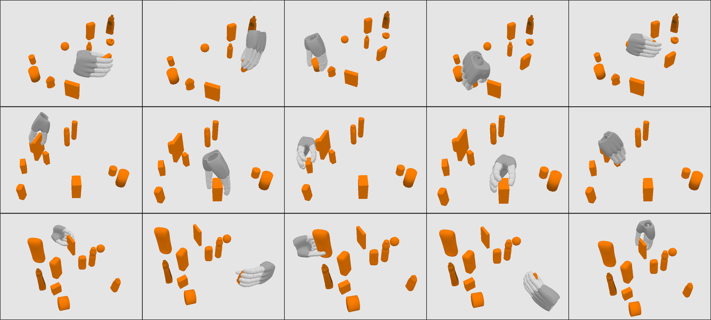

# DGS-Net: Learning Dexterous Grasps from Single-View Point Clouds via a Multi-Object Scene Dataset

## Abstract

Dexterous grasping in multi-object scene constitutes a fundamental challenge in robotic manipulation. Current mainstream grasping datasets predominantly focus on single-object scenarios and predefined grasp configurations, often neglecting environmental interference and the modeling of dexterous pre-grasp gesture, thereby limiting their generalizability in real-world applications. To address this, we propose DGS-Net, an end-to-end grasp prediction network capable of learning dense grasp configurations from single-view point clouds in multi-object scene. Furthermore, this work proposes a two-stage grasp data generation strategy that progresses from dense single-object grasps to dense scene-level grasps. A high-quality grasping dataset with pre-grasp configurations is constructed, featuring multi-object, single-view point clouds. The dataset comprises 307 objects, 240 scenes, and over 350k validated grasps, offering both diverse grasping configurations and complex environmental conditions. Experimental results demonstrate that DGS-Net achieves grasp success rates of 88.63\% in simulation and 78.98\% on a real robotic platform, surpassing existing methods and validating its efficacy and generalization capability. Our dataset is available at https://github.com/4taotao8/DGS-Net.

## Dataset Overview

Our dataset contains over 60k RGB-D images from 240 multi-object scenes, each with 5-15 randomly selected objects, captured from 256 viewpoints per scene, yielding more than 350k valid grasp instances. Each sample includes the scene point cloud, grasp center point semantic labels, dexterous hand grasp poses, pre-grasp and final joint configurations, occlusion information, and segmentation masks. In contrast to most existing datasets that provide only final grasp configurations, we additionally include pre-grasp hand poses, capturing the hand's initial state during approach. This design better reflects real-world grasping behavior and enhances sim-to-real transfer.

## Dataset Download

**Main Dataset:**  https://pan.baidu.com/s/1SL4EADnPFlTuN-PTyRcVHg?pwd=7816 Access Code: 7816

## Real and Sim Example




## Dataset Details
```
Data/
├── scenes/                         # Stage II Grasp Data
│   ├── scene_0000/
│   │   ├── rgb/                    # RGB images (256 viewpoints)
│   │   ├── depth/                  # Depth images
│   │   ├── pointcloud/             # Scene point clouds
│   │   ├── segn/                   # Segmentation masks
│   │   ├── grasp/                  # Grasp annotations
│   │   ├── cam_extrinsic.txt       # Camera extrinsic parameters for each viewpoint
│   │   ├── cam_info.txt            # Camera intrinsic parameters
│   │   ├── grasp_labels.txt        # Successful grasp poses and joint angles
│   │   ├── obj_info.txt            # Object information and metadata in the scene
│   │   └── visible_mask.txt        # Object visibility information in RGB images for each viewpoint
│   ├── scene_0001/
│   └── ...
└── grasp_labels/                   # Stage I Grasp Data
    ├── bowl/                       # Dexterous hand grasp poses for bowl objects
    │   ├── 024_bowl/               # Grasp data for 5 different scaling factors
    │   └── ...
    ├── cuboid/                     # Dexterous hand grasp poses for cuboid objects
    ├── cylinder/                   # Dexterous hand grasp poses for cylinder objects
    ├── stick/                      # Dexterous hand grasp poses for stick objects
    └── sphere/                     # Dexterous hand grasp poses for sphere objects
```

